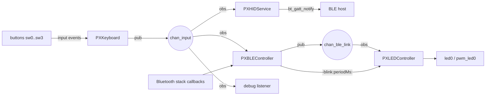

# PX Keyboard

A Bluetooth LE HID keyboard firmware for the nRF52833 DK, written in
[Objective-Z](https://github.com/rodrigopex/objective-z) — the heap-free,
ahead-of-time Objective-C subset for Zephyr RTOS.

Four buttons type `pxkb`; the same four, held for five seconds, become a
gesture layer (advertising toggle, link drop, battery report, forget-bond).
Pairing shows its passkey as LED blinks instead of a screen. About 1,700
lines of Objective-Z, no heap, no Objective-C runtime.

v0.2.0.

## Architecture

Everything is a singleton that talks to its neighbours only through two
zbus channels:



`chan_input` (owned by `PXKeyboard`) carries one semantic key event per
publication; `chan_ble_link`
(owned by `PXBLEController`) carries link state. Publishers never know their
consumers; consumers subscribe from their own file and never call their
publishers. The rules behind this are collected in
[docs/OZ-IDIOMS.md](docs/OZ-IDIOMS.md).

Battery acquisition follows the same boundary: `PXBLEController` publishes a
successful reading through Zephyr's Battery Service, while an
`id<PXBatterySource>` supplies the percentage. The DK has no battery
measurement hardware, so its default `PXStaticBatterySource` deliberately
reports a fixed development value of 100%.

## What Objective-Z buys here

- **Blocks at callback registration sites.** The BLE connection callbacks are
  written inline where they are registered
  ([PXBLEController.m](src/PXBLEController.m)), instead of named functions
  scattered across the file.
- **Protocols ask runtime questions.** `PXLEDController` holds an
  `id<PXToggleable>` and asks at init whether its indicator also conforms to
  `PXDimmable`, choosing breathe-vs-blink without any switch on the driver
  ([PXLEDController.m](src/PXLEDController.m)).
- **Inheritance for shared driver code.** `GPIOPin` handles the devicetree
  spec and readiness check once; `GPIOOutput` specialises it as an output
  ([GPIOPin.m](src/GPIOPin.m)).
- **Heap-free singletons.** Every subsystem is `[Class sharedInstance]` and
  implements `-getDescription:maxLength:`, which is what lets `px_info` dump
  the whole app in four lines ([main.m](src/main.m)).

## Requirements

- nRF52833 DK (`nrf52833dk/nrf52833`), the default and the board verified
  on hardware
- or nRF54L05 on the nRF54L15 DK (`nrf54l15dk/nrf54l05/cpuapp`), paired
  on hardware with the passkey read off the LED
- Zephyr SDK 1.0.1 (the justfile default; override with `just sdk=...`)
- `west`, `just`, `tio`

## Workspace layout

px-keyboard is not a west project. It sits _next to_ the Objective-Z module
and a Zephyr checkout, and the build files resolve both relative to this
repository:

```
objective-z-workspace/
├── deps/zephyr      # ZEPHYR_BASE
├── objective-z/     # ZEPHYR_EXTRA_MODULES
└── px-keyboard/     # this repository
```

`CMakeLists.txt` adds `../objective-z` as an extra module; the justfile
resolves `ZEPHYR_BASE` to `../deps/zephyr` from the parent directory.

## Build, flash, run

```
just         # list the recipes
just run     # build + flash + monitor
```

Two defaults are machine-specific and overridable per invocation:

```
just sdk=~/.local/zephyr-sdk-1.0.0 rebuild
just tty=/dev/tty.usbmodemXXX monitor
```

The nrf54l05 has recipes of its own, and its DK enumerates a different
serial port, so `tty` needs overriding for it too:

```
just rebuild-54
just tty=/dev/tty.usbmodemXXX run-54
```

`kernel thread stacks` works in every build, because the kernel shell turns
on the options it needs. ZView also needs runtime, heap and slab stats, and
those come from the `zview` snippet rather than from `prj.conf`. Any recipe
that builds accepts the snippet:

```
just snippet=zview rebuild
just snippet=zview rebuild-54
```

Use `just rebuild` after touching `prj.conf`, `app.overlay`,
`CMakeLists.txt`, or the transpiler.

## What you should see

1. Boot banner `=== PX Keyboard v0.2.0 ===`, then each singleton logs
   `initialized` as it is first touched, then the wiring report: one
   `channel -> observer` line per registration.
2. `Bluetooth initialized`, `Identity 1: <address>`, `Advertising started`,
   and the LED begins to breathe.
3. Pair from the host: the status LED stops breathing, goes dark for 2 s,
   counts out a passkey (3–10 blinks), and goes dark for 2 s again before
   breathing resumes; the console prints
   `Pairing passkey for <address>: 0000NN`. Type the six digits, leading
   zeros included; once the link is secured the LED stays on for 3 s, then
   goes off.
4. Pressing sw0–sw3 types `p`, `x`, `k`, `b`; the debug observer prints
   semantic events such as `input: down P` and `input: up P`. The changed
   console stream still needs verification on hardware.
5. `px_info` at the shell dumps every subsystem; `kernel thread stacks` shows
   the stack budgets documented in `prj.conf`.

### Gestures (hold 5 s)

The DK silkscreen numbers its buttons 1-4; `sw0` is Button 1, `sw3` is
Button 4.

| Switch | DK button | Key | Action |
|--------|-----------|-----|--------|
| sw0 | Button 1 | P | toggle advertising |
| sw1 | Button 2 | X | drop the current link |
| sw2 | Button 3 | K | push development battery level (fixed at 100%) |
| sw3 | Button 4 | B | forget bond: new address, re-pairable at once |

### LED

One LED carries everything: `pwm_led0`, which drives the pin of `led0` on
the nRF52833 DK and of `led1` on the nRF54L15 DK. What it shows, highest
priority first:

| Situation | LED |
|-----------|-----|
| Passkey | dark 2 s, one blink per passkey unit (250 ms), dark 2 s |
| Pairing or encryption failed | dark 2 s, 5 fast blinks (80 ms), dark 2 s |
| Bond erased (sw3 hold) | dark 2 s, 8 fast blinks (80 ms), dark 2 s |
| Any button held | on until every button is released |
| Advertising, or connected and waiting on pairing | breathing (blinking on a GPIO-only indicator) |
| Link secured (new bond or bonded reconnect) | on for 3 s, then off |
| Idle | off |

A button pressed during a burst does not show until the burst ends, so it
cannot corrupt a count. The bursts used to go to a separate `led1`, which
the nRF54L15 DK cannot do, because its PWM already drives that pin.

## Reading the code

First pass, in this order:

1. The headers in `include/` — each class, protocol, channel and message.
2. `src/main.m` — how little wiring is left once the rules hold.
3. `src/PXKeyboard.m` and `src/PXHIDService.m` — the `chan_input` event flow.
4. `src/PXBLEController.m` — the largest file; its header comment has a
   section index.
5. `src/PXLEDController.m`, then `src/GPIOPin.m` onward — the indicator and
   driver shims.

The `.m` comments are deliberately the *why* layer: stack overflows,
`-ENOMEM` on re-advertising, identity rotation. Skip them on the first pass
and come back when you hit the same problem.

## Tear it apart (learn by removal)

Because every subsystem meets only on a zbus channel, the BLE half of the
app is deletable. This is a recipe for _your own checkout_, not a change to
this repository:

1. Delete `src/PXBLEController.m`, `src/PXHIDService.m`, and
   `src/PXLEDController.m`.
2. In `CMakeLists.txt`, drop those three from `objz_transpile_sources`.
3. In `src/main.m`, drop the `PXBLEController`/`PXHIDService`/
   `PXLEDController` imports, the three `px_info` lines, and the
   `[[PXBLEController sharedInstance] start]` call.
4. In `prj.conf`, drop the Bluetooth block while keeping INPUT, ZBUS and the
   debug/shell options.

What remains is input → `chan_input` → the async debug listener: a ~50-line
app worth reading before the full keyboard.

> [!NOTE]
> Pending verification on hardware; the exact `prj.conf` lines are filled
> in after two builds (full, then trimmed).

## New to Objective-Z?

Start with the samples in the
[objective-z repo](https://github.com/rodrigopex/objective-z/tree/main/samples)
(`hello_world`, `gpio_demo`, `transpiled_led`, `transpiled_blocks`), then
the language docs (`docs/ARC.md`), then come back here.

## License

Apache-2.0.
